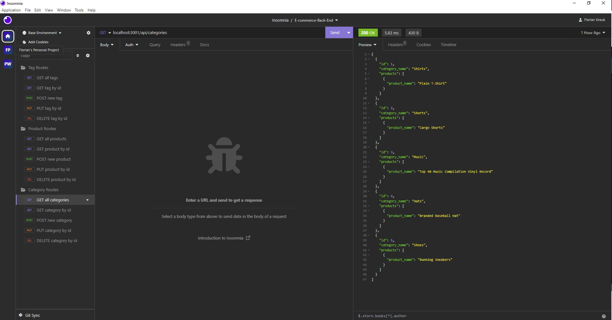

# E-commerce-Back-End

## Description
 
 The E-commerce-Back-End showcases the back end development of an internet retail company's e-commerce site using the latest technologies. This involves setting up the database connection, initializing and seeding the database, starting the server, and then successfully interacting with the API endpoints for the website using Insomnia Core and various CRUD (create, read, update, and delete) operations.
 
 ## Table of Contents
 
 - [Installation](#installation)
 - [Usage](#usage)
 - [License](#license)
 - [Credits](#credits)
 - [Contributing](#contributing)
 - [Tests](#tests)
 - [Questions](#questions)
 
 ## Installation
 
 To install this project, clone this repository and run "npm i" in an integrated terminal. You must have node installed. Ensure you have installed express, sequalize, and mysql2. Next, login to the MySQL shell and run "source db/schema.sql", followed by "use ecommerce_db". Then quit your MySQL shell and run "npm run seed", followed by "npm start". All set!

 Note: This file utilizes a .env file, which is ignored by the .gitignore file. Please be sure to create an .env file with your credentials. It will contain the following syntax:

    DB_NAME='ecommerce_db'
    DB_USER='YOUR_USERNAME'
    DB_PW='YOUR_PASSWORD'
 
 ## Usage
 
 To use the back-end, follow the steps outlined in the installation instructions section above. Open Insomnia Core and replicate the CRUD operations outlined in the video.
 
See below a screenshot of the prompts in action:

See below a walkthrough video for utilizing the application:

 
 ## License
 
 Licensed under MIT (the 'License'); you may not use this file except in compliance with the License. 
 
 You may obtain a copy of the License by navigating to https://opensource.org/licenses/MIT.
 
 Unless required by applicable law or agreed to in writing, software distributed under the License is distributed on an 'AS IS' BASIS, WITHOUT WARRANTIES OR CONDITIONS OF ANY KIND, either express or implied. See the License for the specific language governing permissions and limitations under the License."
 
 
 ## Credits

This project was built as part of the 2023 UCONN full stack coding bootcamp. Week 13 materials, including the finished mini-project code, was referenced in completing this assignment.
 
 
 ## Contributing
 
 Not Applicable
  
 
 ## Tests
 
 Not Applicable
 
 
 ## Questions

 To visit my GitHub profile, simply navigate using the following link: [GitHub](https://github.com/f-kreuk).